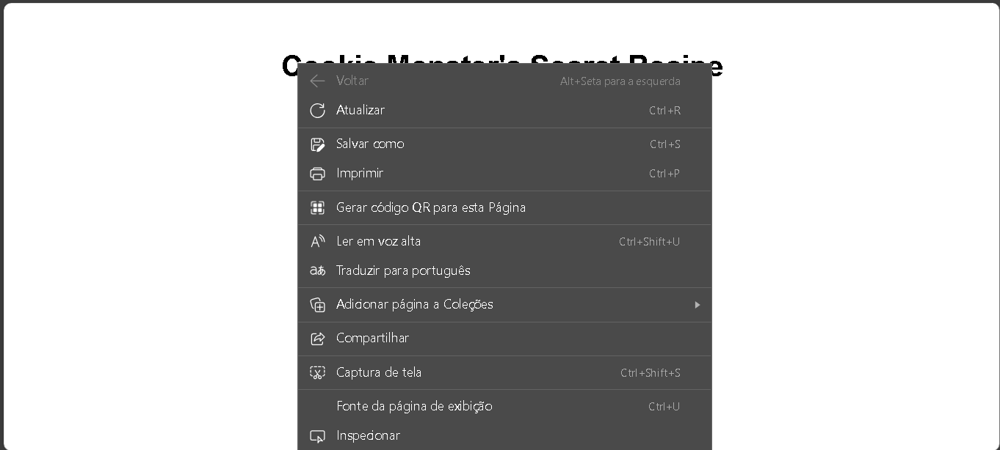
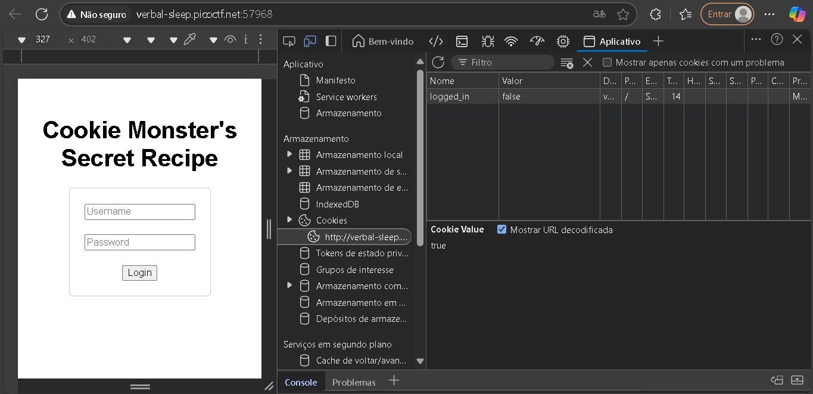
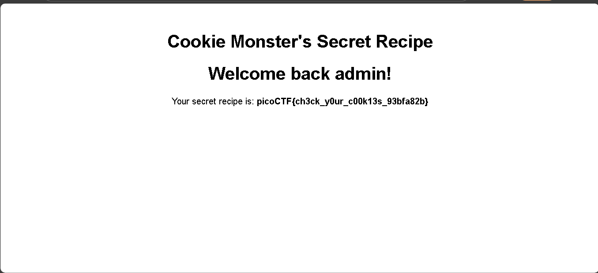

# Cookie Monster: Receita Secreta  
**Resolvido por @IgorGabriel505**  
Este é um CTF sobre *Cookies HTTP* e *Controle de Acesso em Aplicações Web*.

---

## Temas Envolvidos

- Manipulação de cookies HTTP  
- Falhas de autenticação baseadas no lado do cliente  
- Ferramentas de desenvolvedor do navegador (Microsoft Edge)

---

## Descrição do Desafio  

O desafio forneceu um link para o site chamado Cookie Monster, com a seguinte proposta:

> "O Cookie Monster escondeu sua receita secreta de cookies em algum lugar do seu site. Sua missão é encontrá-la."

Site fornecido:  
[http://verbal-sleep.picoctf.net:57968](http://verbal-sleep.picoctf.net:57968)

---

## Resolução do Desafio

A resolução foi feita utilizando o **Microsoft Edge**, seguindo os seguintes passos:

### 1. Acesso à Página

Ao acessar o site, a página exibia uma tela de login solicitando um usuário e uma senha, e eu não tinha nenhum deles. Não havia nenhum conteúdo na página além da página de login, então decidi inspecionar e acessar o código-fonte da página em busca de algumas informações úteis que poderia me ajudar a encontrar a flag.

### 2. Abertura das Ferramentas de Desenvolvedor

No **Microsoft Edge**, cliquei com o botão direito do mouse sobre a página e selecionei a opção **"Inspecionar"**. Após isso eu fui atrás de encontrar os cookies da página (já que imaginei que o enredo da questão seria uma dica para isso):

- Acessei a aba **"Aplicativo"** (ou **"Application"**) dentro das ferramentas de desenvolvedor.
- No menu lateral esquerdo, cliquei em **"Cookies"**.
- Dentro dele, selecionei o domínio: `http://verbal-sleep.picoctf.net:57968`.

### 3. Análise e Edição do Cookie

Nos cookies armazenados pelo site, encontrei uma entrada com o nome `logged_in` e valor `false`. Percebi que o site utilizava esse cookie para determinar se o usuário estava autenticado na pagina de login.

Então, editei o valor do cookie diretamente:

- Dei **dois cliques** sobre o valor `false`.
- Alterei para `true`.

### 4. Recarregamento da Página

Após a alteração, pressionei `F5` para recarregar a página do site. Dessa vez, o conteúdo exibido foi diferente: o site mostrou a **receita secreta de cookies** e a **flag** do desafio.
---

## Flag

```text
picoCTF{c00k1e_m0nster_l0ves_c00kies_6E81FC1E}
```
