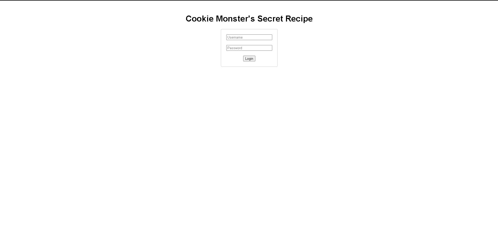
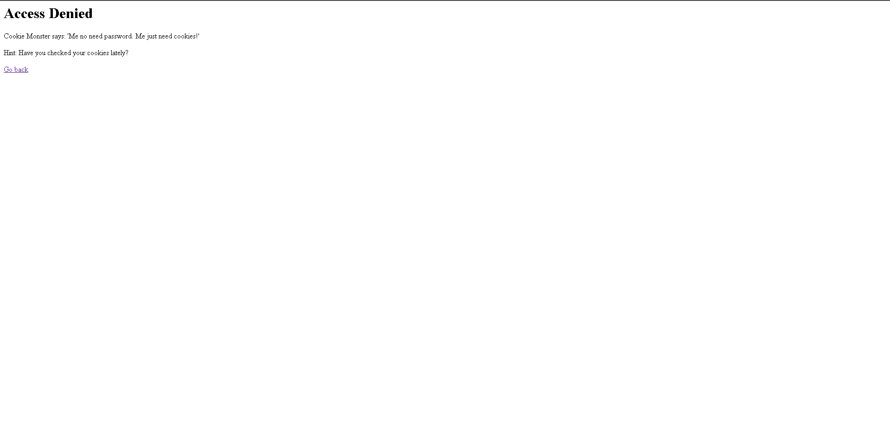
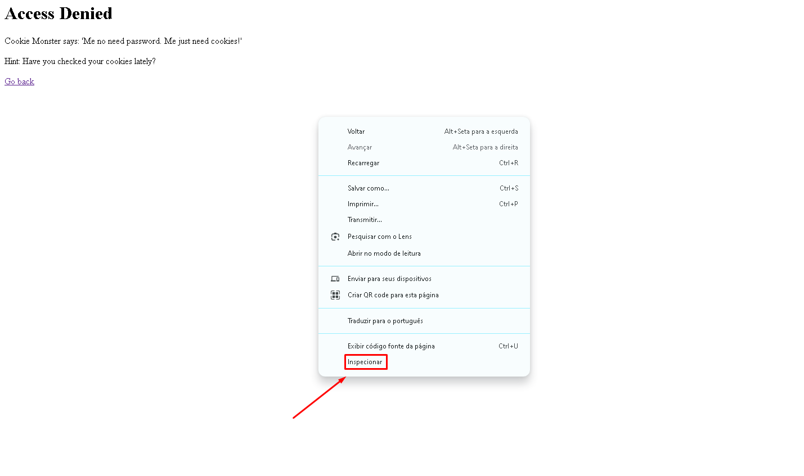
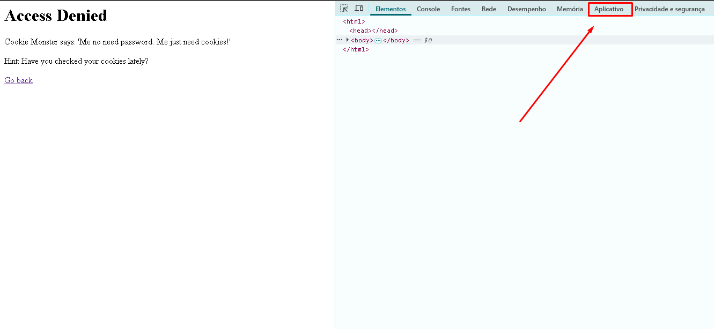
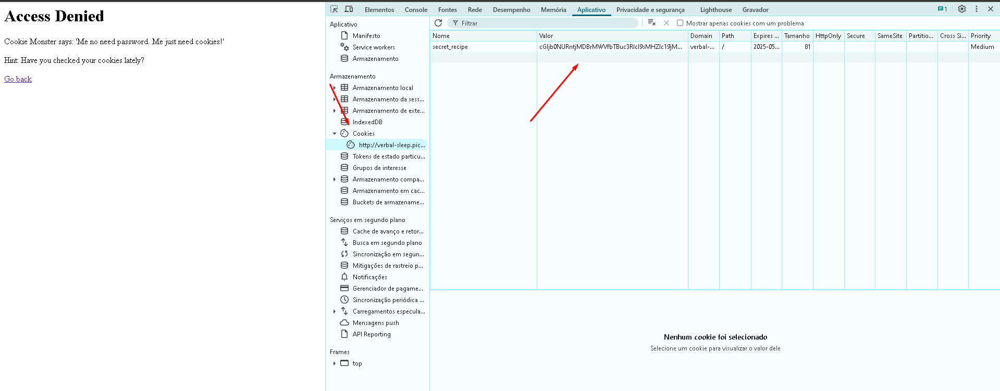
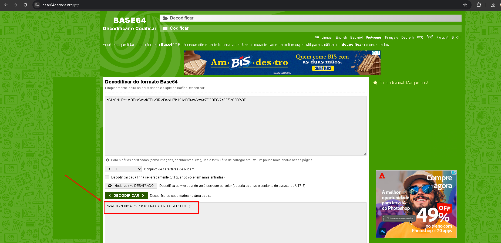

# Cookie Monster: Receita Secreta
**Resolvido por @IgorGabriel505**  
Este é um CTF sobre Cookies HTTP e *Controle de Acesso em Aplicações Web*.

---

## Temas Envolvidos

- Manipulação de cookies HTTP  
- Falhas de autenticação baseadas no lado do cliente  
- Ferramentas de desenvolvedor do navegador (Google Crome)

---

## Descrição do Desafio

O desafio forneceu um link para o site chamado Cookie Monster, com a seguinte proposta:

> "O Cookie Monster escondeu sua receita secreta de cookies em algum lugar do seu site. Sua missão é encontrá-la."

LinK: [http://verbal-sleep.picoctf.net:57968/](http://verbal-sleep.picoctf.net:57968/)

Ao acessar a página inicial, Se encontra um simples formulário solicitando um **nome de usuário** e uma **senha**.




Como nenhuma credencial da senha ou do usuario nos foi dado para a resolução do ctf, eu tente inserir valores aleatórios nas credenciais, nisso fui redirecionado para uma página que informa **"Access Denied"**.



Pelo nome do desafio já deixa a entender que ele terá haver com **"Cookies"**, sendo uma dica importante sobre onde deve ser procurado a Flag. 

---

## Resolução do Desafio 

### Passo 1 — Acessar e Inspecionar os Cookies:
Pelo **Google Crome**, cliquei com o botão direito do mouse sobre a página e selecionei a opção "Inspecionar". Após isso eu fui atrás de encontrar os cookies da página (já que imaginei que o enredo da questão seria uma dica para isso):



- Abri as **Ferramentas de Desenvolvedor** pelo botão inspecionar ou só apertando (F12).
- Fui até a aba **"Application"** (ou "Aplicativo" dependendo do navegador).



- Dentro da seção **Cookies**, localizei um cookie definido pelo site.
  
**Cookie:** cGljb0NURntjMDBrMWVfbTBuc3Rlcl9sMHZlc19jMDBraWVzXzZFODFGQzFFfQ%3D%3D


  
O valor do cookie parecia uma string codificada. Pelo padrão dos caracteres (letras maiúsculas, minúsculas, números e símbolos), estava obivio que estava codificado em  **codificação Base64**.

---

###  Passo 2 — Decodificar o Cookie

- Copiei o valor do cookie com o comando *Control C*.
- Acessei um site de decodificação Base64, sendo o:  
  [https://www.base64decode.org/](https://www.base64decode.org/)  
 

- Ao decodificar, o valor decodificado desse conjunto de caractres foi:

```
picoCTF{c00k1e_m0nster_l0ves_c00kies_6E81FC1E}
```



## Flag:
picoCTF{c00k1e_m0nster_l0ves_c00kies_6E81FC1E}
```
