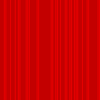
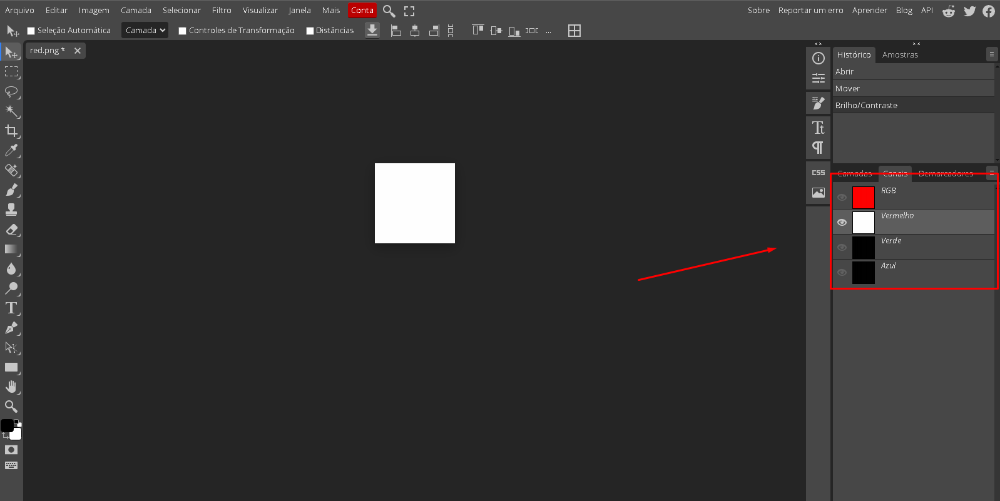
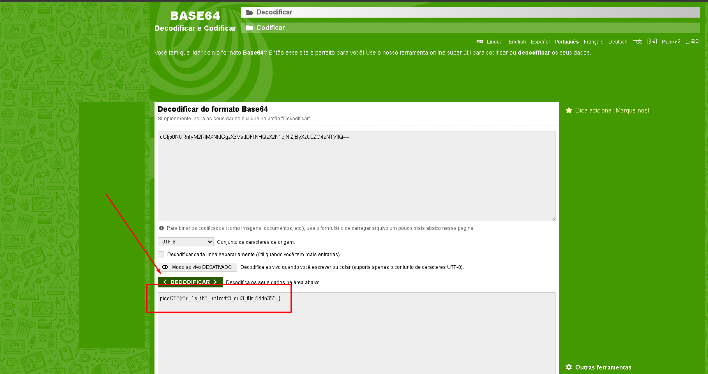

# RED
**Resolvido por @IgorGabriel505**  
 Este é um CTF sobre Forensics

---

## Temas Envolvidos

- Esteganografia em imagens  
- Extração de bits menos significativos (LSB)  
- Decodificação Base64  
- Manipulação de imagem (RGBA)

---

## Descrição do Desafio

Foi fornecida uma imagem chamada `red.png`, que ao abri-la aparentava ser apenas um quadrado totalmente vermelho. No entanto, o desafio sugeria que havia algo oculto, com dicas como:



> “A imagem parece pura, mas é?”  
> “Verifique o nome do Facebook agora.”  

---

## Resolução do Desafio

A resolução foi feita usando análise programática da imagem para extrair dados escondidos nos **bits menos significativos** de cada canal de cor da imagem.

### 1. Inspeção da Imagem

- Abrindo a imagem `red.png` e verificando suas informações, percebe-se que ela tem uma dimensão de `128x128` e  **4 canais RGBA** (vermelho, verde, azul e alpha).



### 2. Extração dos Bits LSB

Cada canal (R, G, B, A) possui 8 bits por pixel. A técnica de esteganografia LSB utiliza o **último bit de cada canal** para armazenar dados ocultos.

Fiz o seguinte:
- Pedi para o **ChatGPT** extraír o **último bit de cada canal** (1 bit por canal, 4 bits por pixel).
- Esses bits eu agrupei em 8 por cada, formando bytes.
- Os bytes foram unidos em uma sequência binária completa.

### 3. Decodificação do Conteúdo

Com os bytes formados, converti para texto e foi encontrado o seguinte texto:

```
cGljb0NURntyM2RfMXNfdGgzX3VsdDFtNHQzX2N1cjNfZjByXzU0ZG4zNTVffQ==
```

Esse conteúdo é claramente codificado em **Base64**. Com isso Decodifiquei o texto por meio do site **'Base64'** :   [https://www.base64decode.org/](https://www.base64decode.org/) 
e apareceu:



```
picoCTF{r3d_1s_th3_ult1m4t3_cur3_f0r_54dn355_}
```

---

## Flag

```text
picoCTF{r3d_1s_th3_ult1m4t3_cur3_f0r_54dn355_}
```
