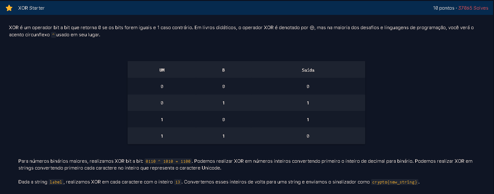

# XOR  
**Resolvido por @IgorGabriel505**  

Este exercício aborda a aplicação da operação *XOR bit a bit em caracteres de uma string*.

---

## Temas Envolvidos

- Operação lógica XOR (OU exclusivo)  
- Manipulação de strings e caracteres Unicode  
- Conversão entre caracteres e seus códigos inteiros Unicode  
- Cifração baseada em XOR

---

## Descrição do Exercício

O desafio me forneceu uma string chamada **label** onde eu deveria utilizando a aplicação **XOR** com a chave 13 para encontrar uma nova string *(sendo a flag do desafio)*.  



---

## Resolução do Desafio

### Passo 1 — Definir a função que aplica XOR em cada caractere
Para

### 2. Aplicar a função na string `"label"` com a chave 13

### 3. Exibir a flag com o resultado obtido

---

## Resultado

- Entrada: `"label"`
- Saída após XOR com chave 13: `"ynory"`
- Flag final exibida:  

```
crypto{ynory}
```

---

