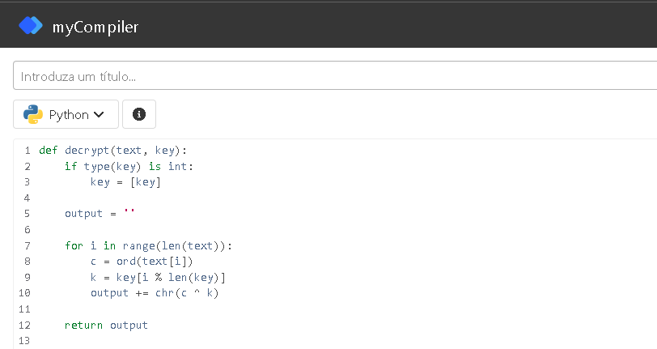
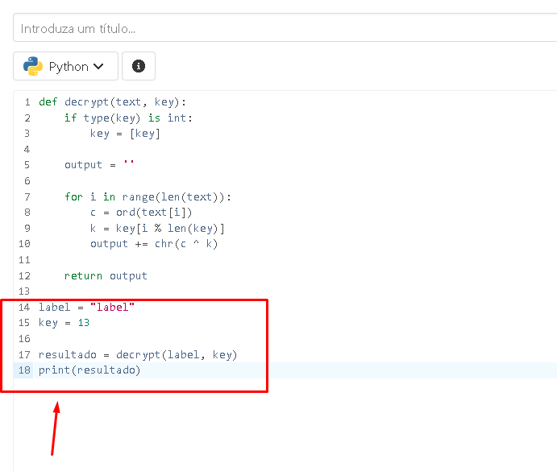
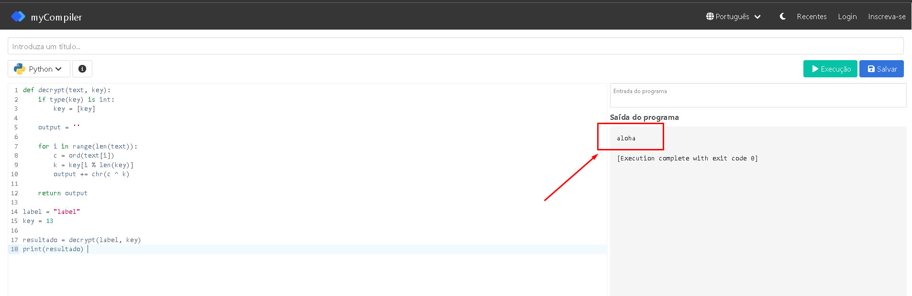

# XOR  
**Resolvido por @IgorGabriel505**  

Este exercício aborda a aplicação da operação *XOR bit a bit em caracteres de uma string*.

---

## Temas Envolvidos

- Operação lógica XOR  
- Manipulação de strings e caracteres Unicode  
- Conversão entre caracteres e seus códigos inteiros Unicode  
- Cifração baseada em XOR

---

## Descrição do Exercício

O desafio me forneceu uma string chamada **label** que foi criptografada em  **XOR** com a chave 13, e eu deveria *descriptogravar* essa string **label** e encontrar a palavra original **antes da aplicação XOR** *(sendo a flag do desafio)*.  


---

## Resolução do Desafio

### Passo 1 — Definir a função que aplica XOR em cada caractere

Para resolver esse desafio eu fui atrás de algum programa que desgriptografa qualquer *string* com uma *chave (key)* em XOR.
Procurando na web pelo navegador **Google Crome** eu encontrei um *projeto no github (em Python)* onde ele justamente faz essa operação XOR.

Projeto do github:   [https://cryptools.github.io/XORCipher/](https://cryptools.github.io/XORCipher/)  


Após ter baixado o cÓdigo do projeto do github eu abri um **site que copila códigos em python** e colei o programa nele.
**site utilizado:** [https://www.mycompiler.io/pt/new/python](https://www.mycompiler.io/pt/new/python)



---

### Passo 2 — Aplicar a função na string `"label"` com a chave 13

Para aplicar a função que executa a **operação XOR** para eu descriptografar oque eu queria eu deveria criar uma variavel *string* com o valor **label** e uma outra variavel *int* com o **valor 13** *(sendo respectivamente a palavra que eu quero descriptografar e a chave em que foi criptografada)*.

- Criei as variaveis **label e key** com os respectivos valores *(label, 13)*.
- Executei a função que **descriptografa em XOR** com os valores das variaveis que criei.
- Executei um comando em que **imprimia na tela** o resultado da descriptografia.



---

### Passo 3 — Exibir a flag com o resultado obtido

Após isso foi só executar o programa que ele já **descriptografava** a string *label* utilizando a chave *13*, e assim encontrando a palavra **aloha** que provavelmente seria a **FLAG**.


```


```
## Flag:
crypto{aloha}
```
