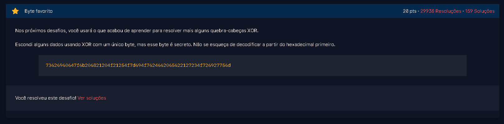
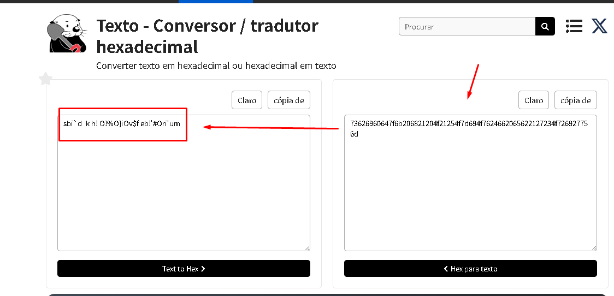

# XOR_9  
**Resolvido por @IgorGabriel505**  

Este exercício aborda a aplicação da operação *XOR bit a bit em caracteres de uma string* e *codificação* e *decodificação hexadecimal*.

---

## Temas Envolvidos

- Operação lógica XOR  
- Manipulação de strings e caracteres Unicode  
- Conversão entre caracteres e seus códigos inteiros Unicode  
- Cifração baseada em XOR

---

## Descrição do Exercício

O desafio fornecida uma *string em hexadecimal* que possui dados criptografados com *uma única chave* de 1 byte usando a **operação XOR**. A tarefa consiste em descobrir qual byte **(chave ou key)** foi usado e *recuperar a mensagem original* que era antes de ser criptografado.



---

## Resolução do Desafio

### Passo 1 — Conversão da string hexadecimal para bytes

Antes de buscar qual era a chave que criptografou a string em XOR eu teria que descriptografar a string que estava em hexadecimal.

Para isso fui atras de um site que descriptografava strings em hexadecimal para assim depois continuar a resolução do desafio.

**String dada:** 73626960647f6b206821204f21254f7d694f7624662065622127234f726927756d

**Site Utilizado:**  [https://pt.rakko.tools/tools/77/](https://pt.rakko.tools/tools/77/)



---

### Passo 2 — Aplicação de XOR com todas as chaves possíveis

<!-- Descreva a segunda etapa da resolução -->

---

### Passo 3 — Identificação da chave correta e extração da flag


---

## Flag:

```
crypto{0x10_15_my_f4v0ur173_by7e}
```
