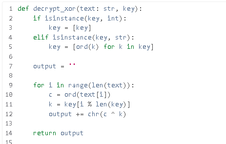
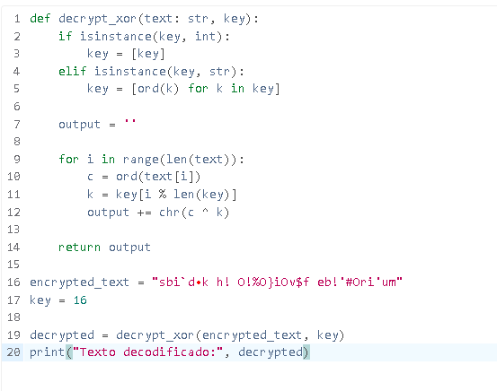

# XOR_9  
**Resolvido por @IgorGabriel505**  

Este exercício aborda a aplicação da operação *XOR bit a bit em caracteres de uma string* e *codificação* e *decodificação hexadecimal*.

---

## Temas Envolvidos

- Operação lógica XOR  
- Manipulação de strings e caracteres Unicode  
- Conversão entre caracteres e seus códigos inteiros Unicode  
- Cifração baseada em XOR

---

## Descrição do Exercício

O desafio fornecida uma *string em hexadecimal* que possui dados criptografados com *uma única chave* de 1 byte usando a **operação XOR**. A tarefa consiste em descobrir qual byte **(chave ou key)** foi usado e *recuperar a mensagem original* que era antes de ser criptografado.


---

## Resolução do Desafio

### Passo 1 — Conversão da string hexadecimal para bytes

Antes de buscar qual era a chave que criptografou a string em XOR eu teria que descriptografar a string que estava em hexadecimal.

Para isso fui atras de um site que descriptografava strings em hexadecimal para assim depois continuar a resolução do desafio.


**String dada:** 73626960647f6b206821204f21254f7d694f7624662065622127234f726927756d

**Site Utilizado:**  [https://pt.rakko.tools/tools/77/](https://pt.rakko.tools/tools/77/)


Após ter descriptografado a string que estava em hexadecimal eu já poderia descobrir qual é a chave em hexadecimal para encontrar a string original.

**String descriptografada em hexadecimal:** sbi`dk h! O!%O}iOv$f eb!'#Ori'um

---

### Passo 2 — Aplicação de XOR com todas as chaves possíveis

Após descriptografar o string que estava em hexadecimal eu fui atrás de algum programa que desgriptografa qualquer *string* com uma *chave (key)* em XOR.

Procurando na web pelo navegador **Google Crome** eu encontrei um *projeto no github (em Python)* onde ele justamente faz essa operação XOR.
Projeto do github:   [https://cryptools.github.io/XORCipher/](https://cryptools.github.io/XORCipher/)

Após ter baixado o código do projeto do github eu abri um **site que copila códigos em python** e colei o programa nele.
**site utilizado:** [https://www.mycompiler.io/pt/new/python](https://www.mycompiler.io/pt/new/python)



Para aplicar a função que executa a **operação XOR** para eu descriptografar oque eu queria eu deveria criar uma variavel *string* com o valor da *string descriptografada* e uma outra variavel *int* com algum numero *( de 1 a 256 )* *(sendo respectivamente a palavra que eu quero descriptografar e a chave em que foi criptografada)*.

- Criei as variaveis que serão a **string descriptografada** e o valor da chave que irei testar (até encontrar a flag).
- Executei a função que **descriptografa em XOR** com os valores das variaveis que criei.
- Executei um comando em que **imprimia na tela** o resultado da descriptografia.


  
---

### Passo 3 — Identificação da chave correta e extração da flag


---

## Flag:

```
crypto{0x10_15_my_f4v0ur173_by7e}
```
